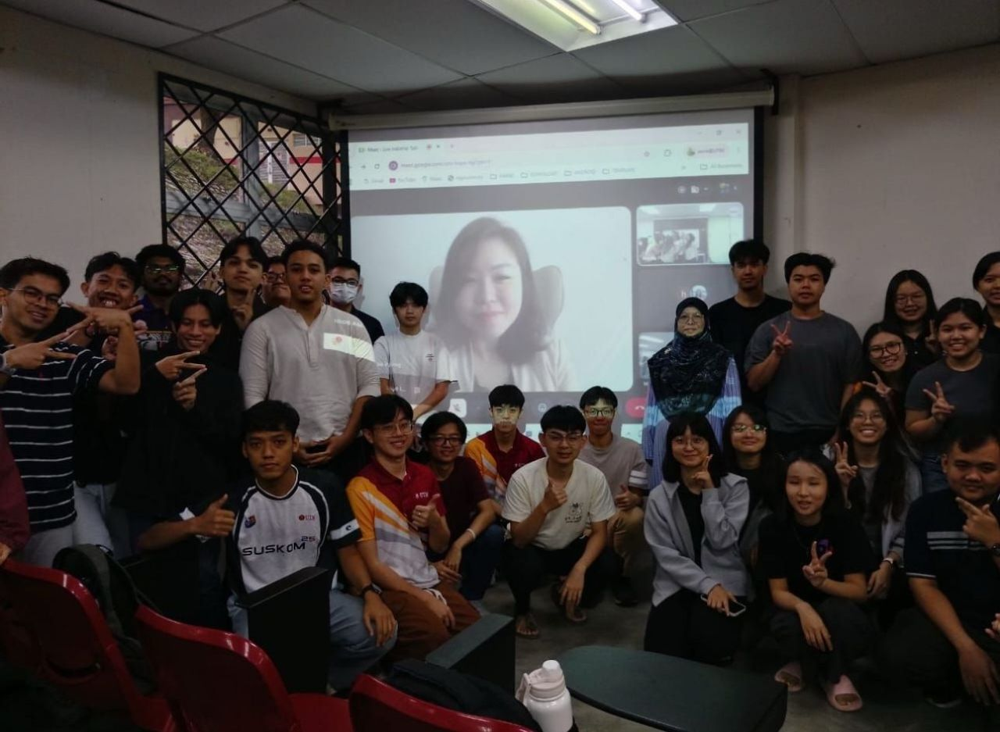
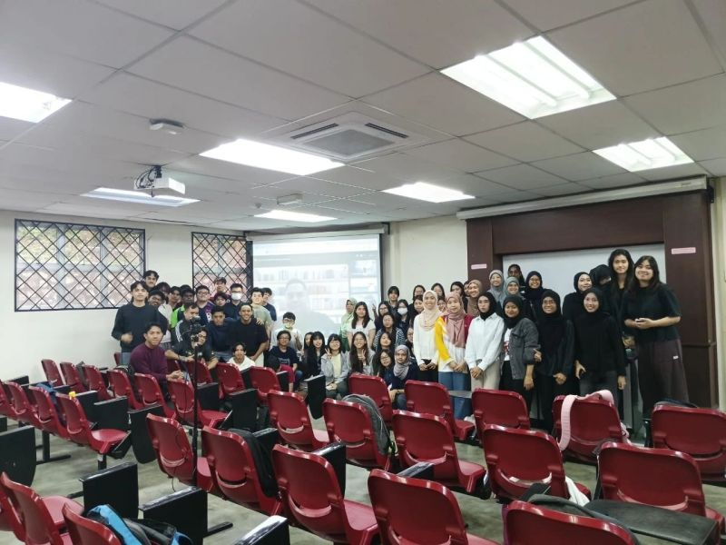

## iZeno Industry Talk

- I attended an industry sharing session by iZeno and gained valuable insights into the evolving technology industry and the career opportunities available within the field.
- The session also highlighted the importance of continuous learning, adaptability, and developing both technical and soft skills to stay relevant in a rapidly changing environment.

## Telekom Malaysia Industry Talk

- I recently had the opportunity to attend an insightful industry talk by Mr. Zaid Waqi Zulkifli from Telekom Malaysia (TM). The session let me witness how massive enterprises manage and leverage data at scale.
- The comparison between a simple nasi lemak seller and a large enterprise was used as a simple but effective way to show this where a small business is run by one person, with one process and one truth, while an enterprise is run on dozens of interconnected systems like CRM, HCM, SCM, Finance, and ERP, each of which is built with thousands of tables, complex relationships, workflows and validation rules.

## EY Campus Tour

- It was an incredible opportunity to learn more about EY's global footprint, corporate strategy, and their upcoming internship programs. What stood out most during the talk was hearing how deeply EY values employee well-being and professional growth. They provided an inside look at how they treat their staff fostering a highly supportive, collaborative, and people-first culture that actively encourages continuous upskilling.

