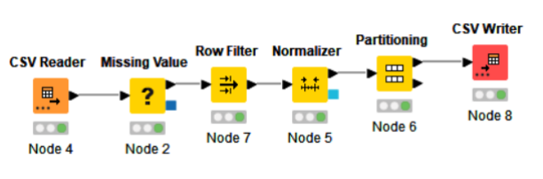
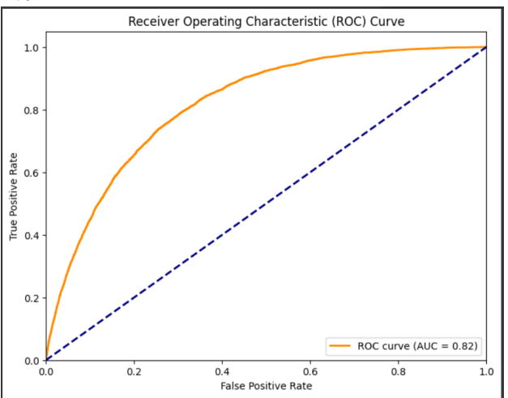
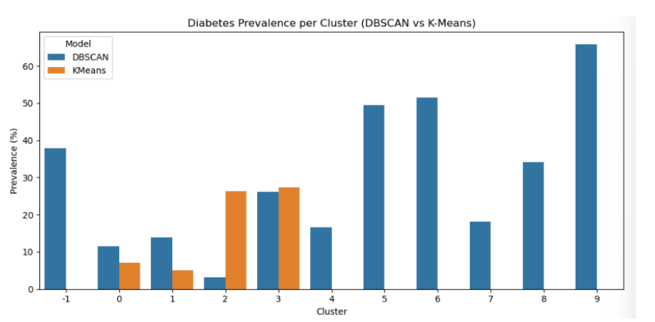
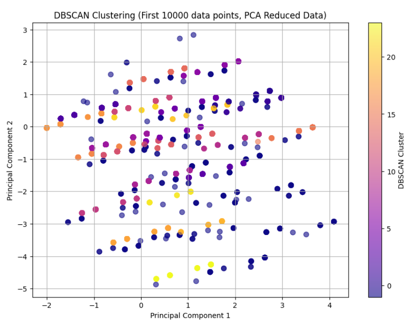

# Y2S2-SECP2753-Data-Mining

## Project 1 
## What I Learned

- I gained practical expertise in advanced data preprocessing workflows within the KNIME Analytics Platform, specifically executing Min-Max scaling normalization, row filtering to remove illogical physical metrics.
- I learned that no single machine learning model solves every question. By testing three different tools (XGBoost, Random Forest, and KNN), I saw firsthand how different algorithms excel at different tasks depending on what you want to achieve.
- I learned that looking only at overall "Accuracy" can be misleading when dealing with an imbalanced dataset where most people do not have diabetes. Focusing on Recall and F1-score taught me how to measure if a model is truly good at catching the dangerous minority cases.

## Challenges I Faced
- **Unbalanced Classes** : The biggest challenge was that the dataset had a massive skew toward healthy individuals (No Diabetes). Because of this severe imbalance, all three models struggled to easily spot the diabetic cases, leaving us with low recall numbers for the minority group across the board.
- **Simplistic Tuning Limits** : We tuned our models using basic manual testing. It was challenging to find the absolute best settings for our algorithms, and we realized that relying on manual steps limited how accurate our models could ultimately become.

## Data Preprocessing using KNIME

## ROC curve for XGBoost

- This graph is a Receiver Operating Characteristic (ROC) Curve for an XGBoost classification model. It measures how effectively the model distinguishes between two classes (predicting individuals with Diabetes vs. No Diabetes)

## Project 2
## What I learned

- I learned how to use clustering to find hidden health and behavior patterns in a population without using pre-existing labels. Comparing K-Means (distance-based) and DBSCAN (density-based) taught me that different algorithms show completely different sides of the same data.
- I identified that K-Means is great for grouping people into large, evenly split segments, which helps with general health planning. On the other hand, DBSCAN is perfect for finding hidden, high-risk groups and specific outliers that don't fit into normal categories.
- I learned how to turn mathematical cluster data into easy-to-read charts. Comparing the diabetes risk percentage between different clusters using bar charts and PCA plots made it much easier to show which groups need quick medical attention.

## Challenges i faced
- Finding the best settings for the models (like picking the right number of clusters (k) for K-Means or setting the eps and min_samples for DBSCAN) required a lot of trial and error. Using tools like the Elbow Method or K-distance graphs can sometimes feel subjective and difficult to lock down.
- A major technical hurdle was that DBSCAN requires a massive amount of computing power to run. Because the original dataset had over 200,000 rows, it repeatedly ran out of memory, forcing us to shrink our sample down to just the first 10,000 records to make the code run successfully.
- During initial testing for specific insights, attempting to keep settings uniform across different tasks caused DBSCAN to explode into more than 80 tiny clusters. I had to completely redo the K-distance visual analysis to find a realistic baseline that fit the data.

## Diabetes Prevalence per Cluster — DBSCAN vs. K-Means (Comparative Bar Chart)

- This comparative analysis visualizes the explicit distribution of diabetes prevalence (%) across individual population clusters generated by two distinct unsupervised learning methods: K-Means and DBSCAN.

## DBSCAN Clustering in 2D Space via PCA Reduction

- This scatter plot visualizes the implementation of Density-Based Spatial Clustering of Applications with Noise (DBSCAN) applied to an initial subset of 10,000 data points from the dataset. To circumvent computational limitations and manage high-dimensional lifestyle and health indicators, Principal Component Analysis (PCA) was utilized to project the data onto a 2D coordinate space defined by Principal Component 1 and Principal Component 2.
