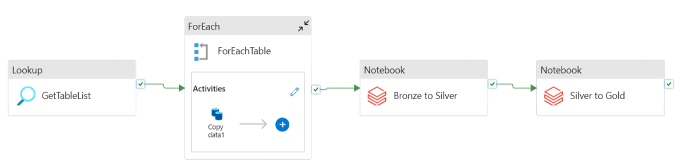

# Y3S2-SECP3843-Special-Topic-in-Data-Engineering-.

## Tutorial 1 Azure Tutorial
## What I Learned

- Troubleshoot real-world data pipeline issues across multiple stages of the pipeline lifecycle, from ingestion through transformation to serving.
- Gained hands-on experience with Azure Key Vault for secret management, understanding why centralised secret storage is preferred over hardcoded credentials across services.
- Integrate Azure Key Vault with multiple Azure services (e.g., Data Factory, Databricks) as a unified secrets layer — a pattern commonly used in production environments.
- Developed cost awareness for cloud-based pipelines on Azure, researching and applying strategies to minimise unnecessary spend:
  1. Disabling Azure Data Factory triggers when not in use
  2. Reducing Databricks compute auto-termination time to avoid idle cluster costs

## End-to-End Data Pipeline showing ingestion from SQL Server to Databricks transformation

## Tutorial 2 Apache Spark 
## What I Learned

- Gained hands-on, practical experience with Apache Spark beyond theoretical understanding, applying PySpark in a real ETL pipeline from ingestion through to serving.
- Learned to handle real-world data quality issues, specifically inconsistent geographic data across 12 annual CSV files using PySpark string normalisation functions to standardise values before loading.
- Deepened understanding of Star Schema design philosophy, including how dimension and fact tables are structured to optimise analytical query performance.
- Built and extracted dimension tables (e.g., DIM_LOCAL) from raw source data, navigating the practical challenges of mapping inconsistent source fields to a clean, unified schema.

## Multidimensional Data Model using Star Schema architecture

## Tutorial 3 
## What I Learned

- Understood the limitations of shallow ANN and CNN architectures in image classification tasks — specifically their susceptibility to overfitting and spatial feature extraction constraints.
- Learned to diagnose overfitting quantitatively, identifying a training-to-testing variance delta of 8.24% and a testing accuracy ceiling of 69.89% as key performance bottlenecks.
- Gained experience building an on-the-fly data augmentation pipeline to artificially expand training diversity and reduce the model's tendency to memorise training noise.
- Applied Batch Normalisation to stabilise gradient flow across deeper network layers, improving training stability and convergence.
- Implemented multi-tiered dropout regularisation as a defence mechanism against overfitting across different depths of the network.
- Learned to stack deeper convolutional layers progressively to improve spatial feature extraction for visually similar classes (e.g., automobiles vs. trucks).
- Achieved measurable, quantifiable improvement through systematic architectural changes — reducing the overfitting variance delta from 8.24% to 0.69% and improving testing accuracy from 69.89% to 72.42% with a - cross-entropy loss of 0.8274.

## Comparison (CNN vs New CNN)

## Tutorial 4
## What I learned

- Gained hands-on experience building automated data engineering workflows using AI-assisted tools on the express.dev platform
- Learned how natural language prompts can be translated directly into functional pipeline architectures
- AI agents abstract away tedious boilerplate tasks — API connections, cron scheduling, and data warehouse synchronization — allowing focus on high-level system logic
- Diagnosed real-world Snowflake credential validation issues as part of practical troubleshooting experience
- Resolved nested JSON structural anomalies where data fields were returning null values
- Observed the AI agent generate an in-memory transformation map to flatten JSON payloads into clean relational columns
- This demonstrated the practical potential of AI-driven development in production-style data engineering scenarios

## AI-Generated ETL Data Pipeline Flow Canvas in Express.dev
